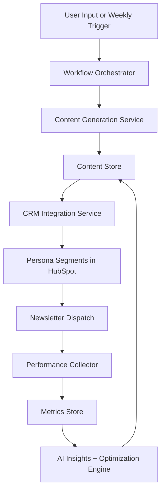
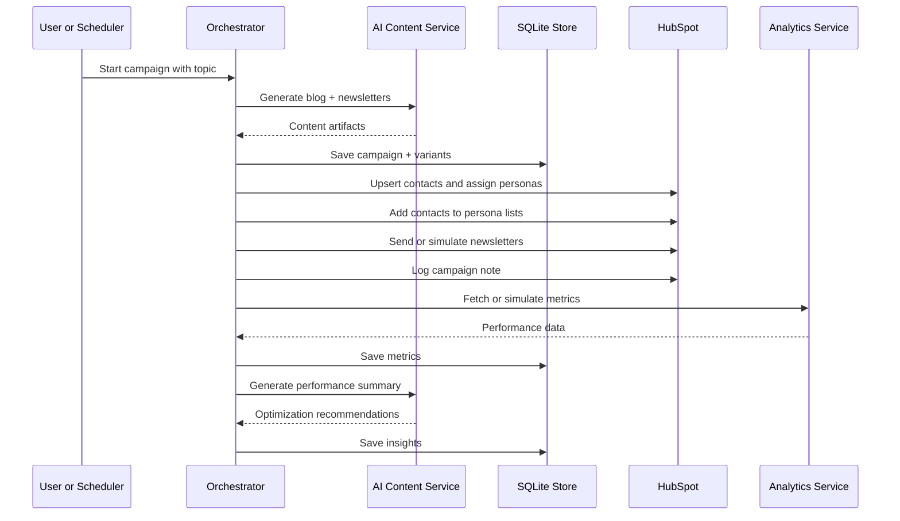

# AI-Powered Marketing Content Pipeline

## 1. Goal

Build a lightweight, mostly hands-free system that:

1. Generates a weekly blog draft and persona-specific newsletter copy from a topic input.
2. Pushes contacts, segments, and campaign activity into a CRM such as HubSpot.
3. Sends or simulates newsletter delivery by persona segment.
4. Collects campaign performance data and uses AI to recommend future optimizations.

The system should be easy to run locally, easy to demo, and realistic enough to show production-style design decisions.

## 2. Recommended Architecture

This project should use a modular monolith rather than microservices.

Why:

- Faster to build and demo for a take-home assignment.
- Fewer moving parts and less infrastructure overhead.
- Still cleanly separates orchestration, AI generation, CRM integration, analytics, and storage.
- Easier to run locally with minimal setup.

### Proposed Stack

- Backend/runtime: Python
- Interface: CLI first, optional lightweight web UI with FastAPI or Streamlit
- AI model: OpenAI API
- Persistence: SQLite for structured records, Markdown/JSON for generated assets
- CRM: HubSpot API
- Scheduling: Manual trigger first, optional cron job for weekly runs

## 3. High-Level Diagram



## 4. Core Personas

Recommended audience segments for NovaMind:

1. Agency Owners
   Focus: growth, margins, client delivery efficiency.
2. Operations Managers
   Focus: workflow consistency, automation, team capacity.
3. Creative Leads
   Focus: protecting creative time, reducing admin overhead, maintaining quality.

These personas are distinct enough to justify personalized messaging and simple enough to implement in a take-home.

## 5. End-to-End Workflow

### Step 1: Trigger

The pipeline begins from one of two triggers:

- Manual run from CLI or web form
- Scheduled weekly run

Example input:

- Topic: `AI in creative automation`
- Optional campaign date
- Optional tone or CTA preference

### Step 2: Content Generation

The content service calls the AI model to produce:

- A blog title
- A blog outline
- A 400-600 word blog draft
- Three newsletter variants, one for each persona

Expected output format:

- `campaign.json` for machine-readable storage
- `blog.md` for readable content
- `newsletters.json` for persona-targeted variants

### Step 3: Content Persistence

All generated assets are stored locally with a shared `campaign_id`.

Suggested local record:

```json
{
  "campaign_id": "cmp_2026_04_13_ai_creative_automation",
  "topic": "AI in creative automation",
  "blog_title": "How Creative Agencies Can Use AI Automation Without Losing Their Edge",
  "personas": ["agency_owner", "ops_manager", "creative_lead"],
  "status": "generated"
}
```

### Step 4: CRM Sync

The CRM integration service:

1. Creates or updates contacts in HubSpot.
2. Stores persona information as a contact property such as `persona_type`.
3. Adds contacts to the matching static list or segment.
4. Logs campaign activity to HubSpot using notes or a custom object if available.

Recommended MVP approach:

- Real integration for contacts, lists, and notes
- Local storage for full campaign history
- Simulated sending if full marketing-send permissions are unavailable

### Step 5: Newsletter Dispatch

For each persona:

1. Select the matching newsletter variant.
2. Resolve the appropriate contact list.
3. Send through HubSpot if available, or simulate the send and persist the event.

Logged fields:

- `campaign_id`
- `persona`
- `newsletter_subject`
- `newsletter_body`
- `crm_list_id`
- `send_timestamp`
- `send_status`

### Step 6: Performance Collection

After the campaign is sent or simulated, the analytics service records:

- Open rate
- Click rate
- Unsubscribe rate
- Delivery count
- Bounces if available

For the take-home, performance data can come from:

- Real CRM API metrics if accessible
- Simulated metrics seeded per persona for repeatable demos

### Step 7: AI Performance Summary

The optimization service compares results across personas and generates a short summary such as:

> Operations Managers had the strongest click-through rate. Future campaigns should emphasize workflow reliability and concrete examples of time saved.

It can also recommend:

- Next blog topics
- New subject line angles
- CTA changes
- Content themes to test next week

## 6. Logical Components

### A. Workflow Orchestrator

Responsibilities:

- Accept input
- Run pipeline steps in order
- Handle retries and status updates
- Persist a campaign lifecycle state

Suggested implementation:

- `main.py` or `app/orchestrator.py`

### B. Content Generation Service

Responsibilities:

- Build prompts
- Generate blog content
- Generate persona-specific newsletters
- Optionally support revisions

Suggested outputs:

- Structured JSON
- Markdown artifact for blog content

### C. CRM Integration Service

Responsibilities:

- Upsert contacts
- Assign persona metadata
- Add contacts to segments
- Log campaign events

HubSpot usage for MVP:

- Contacts API
- Lists API
- Notes API
- Marketing send API only if account access allows it

### D. Analytics Service

Responsibilities:

- Fetch newsletter metrics or simulate them
- Normalize metrics by campaign and persona
- Persist historical results for comparisons

### E. Optimization Service

Responsibilities:

- Compare performance across runs
- Summarize results in natural language
- Recommend the next content direction

### F. Storage Layer

Responsibilities:

- Store campaigns
- Store content variants
- Store contacts and segment mappings if needed locally
- Store performance history

Suggested tables:

- `campaigns`
- `content_variants`
- `contacts`
- `campaign_sends`
- `performance_metrics`
- `optimization_reports`

## 7. Data Model

### campaigns

- `campaign_id`
- `topic`
- `blog_title`
- `blog_outline`
- `blog_markdown`
- `status`
- `created_at`

### content_variants

- `variant_id`
- `campaign_id`
- `persona`
- `channel`
- `subject_line`
- `body`
- `version`

### contacts

- `contact_id`
- `email`
- `first_name`
- `persona`
- `crm_contact_id`

### campaign_sends

- `send_id`
- `campaign_id`
- `persona`
- `crm_list_id`
- `crm_email_id`
- `sent_at`
- `status`

### performance_metrics

- `metric_id`
- `campaign_id`
- `persona`
- `open_rate`
- `click_rate`
- `unsubscribe_rate`
- `bounce_rate`
- `recorded_at`

### optimization_reports

- `report_id`
- `campaign_id`
- `summary`
- `recommended_topics`
- `recommended_cta`
- `created_at`

## 8. Sequence Diagram



## 9. API Integration Notes

### HubSpot

Recommended realistic endpoint categories:

- Contacts: create or update contacts
- Lists: manage persona-based list membership
- Notes: log campaign activity against records
- Marketing email APIs: use if account permissions allow programmatic send

Fallback design:

- If marketing send is not available, persist a simulated send event with realistic payload structure and note the assumption in the README.

### OpenAI

Use one model for:

- Blog and newsletter generation
- Post-campaign summary and optimization recommendations

Optional enhancement:

- Use a separate prompt template for each phase rather than one large prompt

## 10. Error Handling and Reliability

The orchestrator should make each step observable and restartable.

Recommended patterns:

- Persist status after every major step
- Mark steps as `pending`, `completed`, or `failed`
- Allow re-running from the last failed step
- Log raw API responses where safe for debugging

Possible failure points:

- AI timeout or malformed output
- CRM auth failure
- Missing persona mapping
- Partial send success
- Metrics fetch unavailable

## 11. Security and Secrets

Store secrets in environment variables:

- `OPENAI_API_KEY`
- `HUBSPOT_ACCESS_TOKEN`

Do not commit tokens or raw personal contact data.

For demo contacts:

- Use mock email addresses and fictional names

## 12. MVP Scope Recommendation

To keep the project strong and shippable, the MVP should include:

1. Topic input
2. AI-generated blog draft
3. Three persona-based newsletter variants
4. Local persistence in SQLite and Markdown/JSON
5. HubSpot contact upsert and segmentation
6. Campaign log entry in CRM
7. Simulated or real metrics collection
8. AI-generated optimization summary

Optional bonus features after MVP:

- Revision workflow for copy variants
- Subject line A/B options
- Dashboard for viewing campaigns
- Weekly scheduler
- Trend-based topic recommendation engine

## 13. Suggested Project Structure

```text
marketing_agent/
├── app/
│   ├── orchestrator.py
│   ├── models.py
│   ├── config.py
│   └── prompts/
├── services/
│   ├── content_service.py
│   ├── crm_service.py
│   ├── analytics_service.py
│   ├── optimization_service.py
│   └── storage_service.py
├── data/
│   ├── campaigns/
│   └── marketing.db
├── main.py
├── requirements.txt
└── README.md
```

## 14. Demo Narrative

A clean demo story would be:

1. Run one command with a topic.
2. Show the generated blog and three newsletter versions.
3. Show contacts synced into HubSpot by persona.
4. Show a sent or simulated campaign log.
5. Show stored performance metrics.
6. Show the AI-written optimization summary and next-topic suggestions.

## 15. Key Assumptions

- The project is run locally.
- Mock contacts are acceptable.
- Simulated performance data is acceptable if direct email analytics are unavailable.
- HubSpot is used as the preferred CRM, but another CRM could be swapped behind the integration layer.
- One weekly blog campaign is enough to demonstrate the workflow.

## 16. Recommended Next Step

Implement this in two passes:

1. Build the full local pipeline with persistence and simulated sending.
2. Add real HubSpot contact, list, and campaign logging integration.

That approach reduces demo risk while still showing realistic CRM integration.
